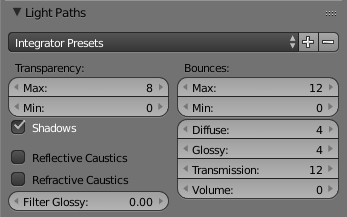

# Initial Settings:

## Bounces
Still logo and text
Using absolute number of bounces (set max and min to the same number)

0 Lighting Bounces: 2:30
Nearly zero noise around logo or text.

4 Lighting Bounces: 2:31
Very Slight noise around logo and text, not noticeable at scale
No real change in performance.

12 Lighting Bounces: 2:30
Noise around logo and text is less noticeable

#### Result:
No performance change at all.

## Reflective and Refractive Caustics

Both Enabled: 2:30

Both Disabled: 2:26

#### Result:
Barely any difference.
